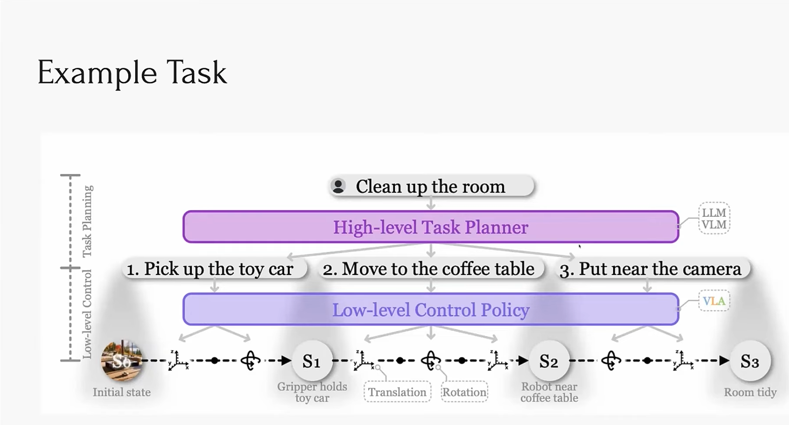
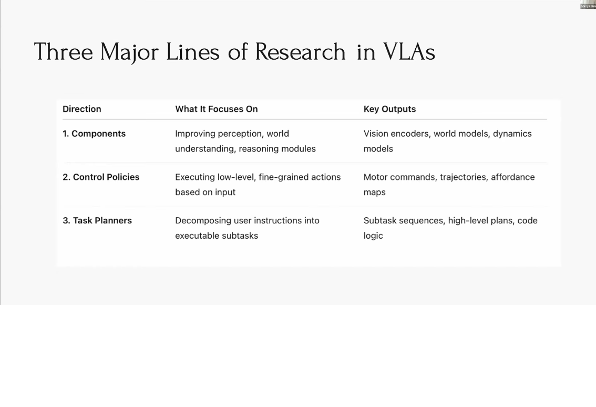

# An evaluation of automated knowledge graph population from unstructured task descriptions using LangExtract.
## Potential RQ's
1. How effective is the TASK-MATS ontology when paired with a Vision Language Action Model?

2. 

## Introduction
## Background
## Merit
## Novely 
## Timeliness
## Impact
## Proposed work

## Timeline
# References
[Exploring Vision-Language-Action (VLA) Models: From LLMs to Embodied AI](https://www.youtube.com/watch?v=J_M4ctnzYp4)
[REASSEMBLE: A Multimodal Dataset for Contact-rich Robotic Assembly and Disassembly](https://tuwien-asl.github.io/REASSEMBLE_page/)
[A Survey on Vision-Language-Action Models for Embodied AI](https://arxiv.org/pdf/2405.14093)

